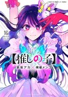
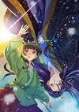
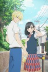
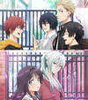

# daiku-alternatives

last updated at: `January 11, 2025 10:24 UTC`

total anilist overrides count: `30`

total tmdb overrides count: `3`

## anilist overrides

### 2034 - as `Lovely★Complex`

* no cover override
* change note:
```
i like the star
```

### 18661 - as `Kamisama Kiss OVA`

* no cover override

### 20837 - as `Blue Spring Ride: unwritten`

* no cover override

### 20900 - as `Blue Spring Ride PAGE.13`

* no cover override

### 54294 - as `Blue Spring Ride`

* no cover override

### 98033 - as `Kamisama Kiss: The God Will Be Happy`

* no cover override

### 102423 - as `We Want to Talk About Kaguya`

* no cover override

### 117195



* cover:
  * `small`: [anilist/117195/small.jpg](anilist/117195/small.jpg)
  * `medium`: [anilist/117195/medium.jpg](anilist/117195/medium.jpg)
  * `large`: [anilist/117195/large.jpg](anilist/117195/large.jpg)
* change note:
```
cover of the last volume (from mangadex)
```

### 124080


* cover:
  * `small`: [anilist/124080/small.jpg](anilist/124080/small.jpg)
  * `medium`: [anilist/124080/medium.jpg](anilist/124080/medium.jpg)
  * `large`: [anilist/124080/large.jpg](anilist/124080/large.jpg)
* change note:
```
anilist uses cover art of end of anime, which only shows hori and miyamura
i don't like it, as it doesn't display the variety of characters in the anime
```

### 125367


* cover:
  * `small`: [anilist/125367/small.jpg](anilist/125367/small.jpg)
  * `medium`: [anilist/125367/medium.jpg](anilist/125367/medium.jpg)
  * `large`: [anilist/125367/large.jpg](anilist/125367/large.jpg)

### 125368 - as `Kaguya-sama: Love is War OVA`

* no cover override

### 128643 - as `My Teen Romantic Comedy SNAFU Climax! OVA`

* no cover override

### 130003 - as `Bocchi the Rock!`


* cover:
  * `small`: [anilist/130003/small.jpg](anilist/130003/small.jpg)
  * `medium`: [anilist/130003/medium.jpg](anilist/130003/medium.jpg)
  * `large`: [anilist/130003/large.jpg](anilist/130003/large.jpg)
* change note:
```
replaced poster cuz we didn't see the band well enough
cover art comes from anime re-release as movie 'Bocchi the Rock! Re:'
title: i hate full-capital titles
```

### 143270


* cover:
  * `small`: [anilist/143270/small.jpg](anilist/143270/small.jpg)
  * `medium`: [anilist/143270/medium.jpg](anilist/143270/medium.jpg)
  * `large`: [anilist/143270/large.jpg](anilist/143270/large.jpg)
* change note:
```
teaser key visual of the anime
```

### 150672 - as `Oshi no Ko`

* no cover override
* change note:
```
there was a capital letter to "No" and not for the S2 it disturbed me
```

### 154768 - as `My Dress-Up Darling Season 2`

* no cover override

### 161645



* cover:
  * `small`: [anilist/161645/small.jpg](anilist/161645/small.jpg)
  * `medium`: [anilist/161645/medium.jpg](anilist/161645/medium.jpg)
  * `large`: [anilist/161645/large.jpg](anilist/161645/large.jpg)

### 163327 - as `The Quintessential Quintuplets~`

* no cover override

### 170019 - as `The Angel Next Door Spoils Me Rotten Season 2`

* no cover override

### 170942


* cover:
  * `small`: [anilist/170942/small.jpg](anilist/170942/small.jpg)
  * `medium`: [anilist/170942/medium.jpg](anilist/170942/medium.jpg)
  * `large`: [anilist/170942/large.jpg](anilist/170942/large.jpg)
* airing episodes offset: `-1`
* change note:
```
the cover art is for the cour 2 of the anime
episodes air one week in advance on jp netflix, and anilists bases on that; so -1 to get everywhere's correct next episode number
```

### 171018 - as `Dandadan`


* cover:
  * `small`: [anilist/171018/small.jpg](anilist/171018/small.jpg)
  * `medium`: [anilist/171018/medium.jpg](anilist/171018/medium.jpg)
  * `large`: [anilist/171018/large.jpg](anilist/171018/large.jpg)
* change note:
```
i don't like full-capital titles
```

### 171046 - as `Rascal Does Not Dream of Santa Claus`

* no cover override

### 171457 - as `Too Many Losing Heroines!`

* no cover override
* change note:
```
else the title was too long 💀
```

### 172729 - as `They are Still Being Shaken This Morning`

* no cover override

### 175443



* cover:
  * `small`: [anilist/175443/small.jpg](anilist/175443/small.jpg)
  * `medium`: [anilist/175443/medium.jpg](anilist/175443/medium.jpg)
  * `large`: [anilist/175443/large.jpg](anilist/175443/large.jpg)
* change note:
```
edited version (by me) of the third key visual to remove text
waiting for more files to do a cleaner job
```

### 181444 - as `The Fragrant Flower Blooms With Dignity`



* cover:
  * `small`: [anilist/181444/small.jpg](anilist/181444/small.jpg)
  * `medium`: [anilist/181444/medium.jpg](anilist/181444/medium.jpg)
  * `large`: [anilist/181444/large.jpg](anilist/181444/large.jpg)
* change note:
```
doesn't have a proper cover art yet, will remove when cover art releases
```

### 181641 - as `Alya Sometimes Hides Her Feelings in Russian Season 2`

* no cover override

### 182255 - as `Frieren: Beyond Journey’s End Season 2`

* no cover override

### 182587 - as `Oshi no Ko Season 3`

* no cover override
* change note:
```
its writing didn't match the other seasons'
```

### 185660 - as `Dandadan Season 2`

* no cover override
* change note:
```
again, i don't like full-capital titles
```


## tmdb overrides

### 667520


* cover:
  * `small`: [tmdb/667520/small.jpg](tmdb/667520/small.jpg)
  * `medium`: [tmdb/667520/medium.jpg](tmdb/667520/medium.jpg)
  * `large`: [tmdb/667520/large.jpg](tmdb/667520/large.jpg)

### 776305


* cover:
  * `small`: [tmdb/776305/small.jpg](tmdb/776305/small.jpg)
  * `medium`: [tmdb/776305/medium.jpg](tmdb/776305/medium.jpg)
  * `large`: [tmdb/776305/large.jpg](tmdb/776305/large.jpg)
* change note:
```
edited (by me) cover art to remove title
```

### 916192


* cover:
  * `small`: [tmdb/916192/small.jpg](tmdb/916192/small.jpg)
  * `medium`: [tmdb/916192/medium.jpg](tmdb/916192/medium.jpg)
  * `large`: [tmdb/916192/large.jpg](tmdb/916192/large.jpg)


