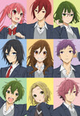
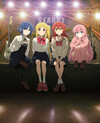

# daiku-alternatives

last updated at: `January 05, 2025 14:25 UTC`

total anilist overrides count: `19`

## anilist overrides

### 2034 - as `Lovely★Complex`

* no cover override
* change description:
```
i like the star
```

### 18661 - as `Kamisama Kiss OVA`

* no cover override

### 20837 - as `Blue Spring Ride: unwritten`

* no cover override

### 20900 - as `Blue Spring Ride PAGE.13`

* no cover override

### 54294 - as `Blue Spring Ride`

* no cover override

### 98033 - as `Kamisama Kiss: The God Will Be Happy`

* no cover override

### 117195


* `size: small`: [117195/small.jpg](117195/small.jpg)
* `size: medium`: [117195/medium.jpg](117195/medium.jpg)
* `size: large`: [117195/large.jpg](117195/large.jpg)
* change description:
```
cover of the last volume (from mangadex)
```

### 124080



* `size: small`: [124080/small.jpg](124080/small.jpg)
* `size: medium`: [124080/medium.jpg](124080/medium.jpg)
* `size: large`: [124080/large.jpg](124080/large.jpg)
* change description:
```
anilist uses cover art of end of anime, which only shows hori and miyamura
i don't like it, as it doesn't display the variety of characters in the anime
```

### 125367


* `size: small`: [125367/small.jpg](125367/small.jpg)
* `size: medium`: [125367/medium.jpg](125367/medium.jpg)
* `size: large`: [125367/large.jpg](125367/large.jpg)

### 125368 - as `Kaguya-sama: Love is War OVA`

* no cover override

### 128643 - as `My Teen Romantic Comedy SNAFU Climax! OVA`

* no cover override

### 130003 - as `Bocchi the Rock!`



* `size: small`: [130003/small.jpg](130003/small.jpg)
* `size: medium`: [130003/medium.jpg](130003/medium.jpg)
* `size: large`: [130003/large.jpg](130003/large.jpg)
* change description:
```
replaced poster cuz we didn't see the band well enough
cover art comes from anime re-release as movie 'Bocchi the Rock! Re:'
title: i hate full-capital titles
```

### 150672 - as `Oshi no Ko`

* no cover override
* change description:
```
there was a capital letter to "No" and not for the S2 it disturbed me
```

### 161645


* `size: small`: [161645/small.jpg](161645/small.jpg)
* `size: medium`: [161645/medium.jpg](161645/medium.jpg)
* `size: large`: [161645/large.jpg](161645/large.jpg)

### 163327 - as `The Quintessential Quintuplets~`

* no cover override

### 170942


* `size: small`: [170942/small.jpg](170942/small.jpg)
* `size: medium`: [170942/medium.jpg](170942/medium.jpg)
* `size: large`: [170942/large.jpg](170942/large.jpg)
* change description:
```
the cover art is for the cour 2 of the anime
```

### 171018 - as `Dandadan`


* `size: small`: [171018/small.jpg](171018/small.jpg)
* `size: medium`: [171018/medium.jpg](171018/medium.jpg)
* `size: large`: [171018/large.jpg](171018/large.jpg)
* change description:
```
i don't like full-capital titles
```

### 171457 - as `Too Many Losing Heroines!`

* no cover override
* change description:
```
else the title was too long 💀
```

### 172729 - as `They are Still Being Shaken This Morning`

* no cover override


